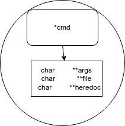
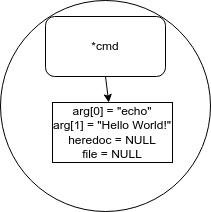
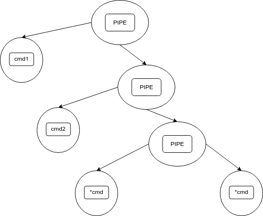

# Usage and installation
This program is a simple version of bash (Bourne-Again SHell). To use it clone the repo, `cd` to its directory and run `make run`. 
Feel free to compare with the bash terminal.

# Basic Introduction
A shell is simply a macro processor that executes commands. The term macro processor means functionality where text and symbols are
expanded to create larger expressions. As a command interpreter, the shell provides the user interface to the rich set of GNU utilities.
The programming language features allow these utilities to be combined. Files containing commands can be created, and become commands themselves.
These new commands have the same status as system commands in directories such as /bin, allowing users or groups to establish custom
environments to automate their common tasks.

# Minishell Operations
## Parsing
Minishell reads its input and divides the input into words and operators, employing the quoting rules to select which meanings to assign various words
and characters.
It parses these tokens into commands and other constructs, removes the special meaning of certain words or characters, expands others. The parsing
is organized into an AST data structure.

## Execution
Minishell execution process is recursive and it  redirects input and output as needed, executes the specified command, waits for the command’s 
exit status, and makes that exit status available for further inspection or processing.

# Minishell's AST Data structure (Abstract Syntax Tree)
Depending on the input, the tree can have one or more levels, with `nodes` corresponding to commands `cmd` or pipes `|` . 
The first node is the root and the last the tail. 
The `cmd` node type is itself a structure of arrays: `args` to hold the command and its arguments, 
`file` in case of redirections, `heredoc`for the special case redirection regarding this minishell.

The simpliest case is a single command.

For example: `echo Hello World!`

More complex cases involve pipes. A node of type pipe does not have a command but it is itself an empy node with its fds assigned properly.
The `child nodes` of this `root` go down left and right. A generic case `cmd1 | <in cmd2 | <<hd | >out `is parsed as below:

